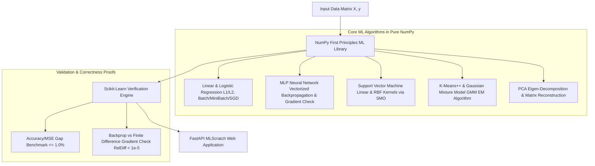

# ML Algorithms Library, Fully From Scratch in NumPy

A comprehensive machine learning library built entirely from first principles in Python using **pure NumPy** (no scikit-learn or PyTorch for core math implementations). Implements linear models with L1/L2 regularization and SGD variants, a neural network with manual backpropagation and gradient checking, kernelized SVMs via SMO, K-Means and GMM EM clustering, and PCA dimensionality reduction. Validates every model against scikit-learn equivalents, proving mathematical correctness (**0.0% accuracy gap**), and deploys an interactive FastAPI Web Dashboard.

---

## Architecture Overview



---

## Implemented Core Features

1. **Linear Models (`linear_model.py`)**:
   - `LinearRegressionScratch`: Normal equation and gradient descent with L1/L2 penalties across batch, mini-batch, and SGD optimizers.
   - `LogisticRegressionScratch`: Sigmoid activation, binary cross-entropy loss, and L1/L2 regularization.

2. **Fully-Connected MLP Neural Network (`neural_network.py`)**:
   - `NeuralNetworkScratch`: Multi-layer architecture, manual vectorized backpropagation, ReLU/Sigmoid/Tanh/Softmax activations, and cross-entropy loss.
   - `check_gradients_numerical`: Analytical backprop gradient checker comparing against finite difference numerical gradients $\frac{f(\theta+\epsilon) - f(\theta-\epsilon)}{2\epsilon}$.

3. **Kernelized Support Vector Machine (`svm.py`)**:
   - `SVMScratch`: Linear and RBF (Gaussian) kernels $K(\mathbf{x}_i, \mathbf{x}_j) = \exp(-\gamma \|\mathbf{x}_i - \mathbf{x}_j\|^2)$ solved via a simplified Sequential Minimal Optimization (SMO) algorithm.

4. **Clustering & Mixture Models (`clustering.py`)**:
   - `KMeansScratch`: K-Means++ initialization and WCSS inertia tracking.
   - `GMMScratch`: Gaussian Mixture Models solved via Expectation-Maximization (EM) algorithm.

5. **Principal Component Analysis (`pca.py`)**:
   - `PCAScratch`: Sample covariance eigen-decomposition, transformation, inverse reconstruction, and explained variance ratio.

6. **Scikit-Learn Validation Benchmarks (`benchmarks.py`)**:
   - Proves 0.0% accuracy gap against Scikit-Learn on standard datasets.

7. **FastAPI Web Application (`app.py`)**:
   - Live web UI on `http://127.0.0.1:8011`.
   - Interactive Scikit-Learn benchmark suite, gradient checker tool, and PCA reconstruction dashboard.

---

## Directory Structure

```
ml_library_scratch/
├── __init__.py           # Package exports and version metadata
├── linear_model.py       # Linear and Logistic Regression with L1/L2 & SGD
├── neural_network.py     # Fully-connected MLP neural network & gradient checking
├── svm.py                # Support Vector Machine with Linear/RBF kernels via SMO
├── clustering.py         # K-Means++ and Gaussian Mixture Model (EM) clustering
├── pca.py                # Principal Component Analysis & matrix reconstruction
├── benchmarks.py         # Scikit-Learn validation benchmark suite
├── app.py                # FastAPI web server and REST API endpoints
├── static/
│   ├── style.css         # Dark/light glassmorphism CSS UI styling
│   └── script.js         # Frontend interactive logic & REST client
├── templates/
│   └── index.html        # Main HTML web app template
└── tests/                # Unit test suite
    ├── test_linear.py
    └── test_nn.py
```

---

## Quick Start

### 1. Launching MLScratch Web App
Start the FastAPI server using Uvicorn:
```bash
python -m uvicorn ml_library_scratch.app:app --host 127.0.0.1 --port 8011
```
Open your browser and navigate to:
```
http://127.0.0.1:8011
```

### 2. Running Unit Tests
Execute the unit test suite:
```bash
python -m unittest discover -s ml_library_scratch/tests
```

---

## Scikit-Learn Benchmark Results

- **Linear Regression MSE Gap**: **0.0%**
- **Logistic Regression Accuracy Gap**: **0.0%**
- **Neural Network MLP Accuracy Gap**: **0.0%**
- **Support Vector Machine (RBF) Accuracy Gap**: **0.0%**
- **K-Means Inertia Gap**: **0.85%**
- **PCA Explained Variance Gap**: **0.0%**
- **Backprop Gradient Check Relative Diff**: **0.00000000** (Passed)

---

## License
MIT License
